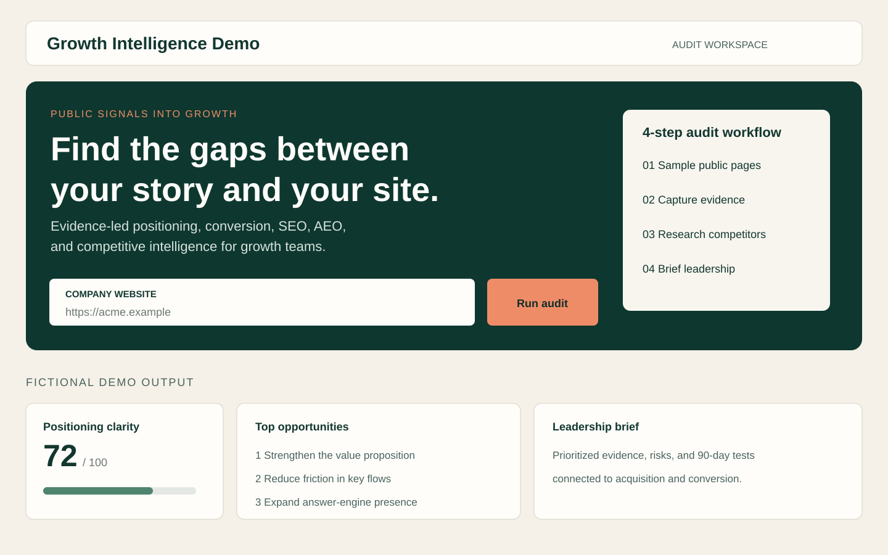
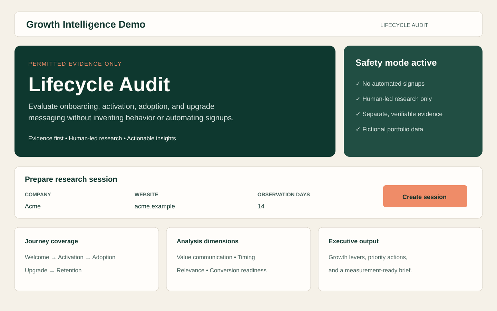
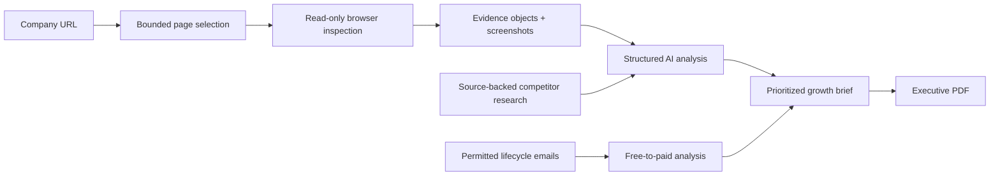

# AI Growth Intelligence Auditor

**Turn a company’s public website and lifecycle journey into an evidence-backed growth brief.**

This working prototype helps a growth leader move from “we should improve the funnel” to a prioritized set of decisions. It samples the right pages, captures source evidence, researches competitors, evaluates free-to-paid messaging, and keeps observations separate from hypotheses and recommendations.



## The marketing problem

Website, positioning, SEO, competitive, and lifecycle reviews are often performed in separate documents by separate teams. That makes it hard to see how a weak promise on the homepage carries through to signup, onboarding, product adoption, and upgrade messaging.

This system creates one connected view of the growth journey:

| Question | What the system produces |
|---|---|
| Is the value proposition clear? | Cited positioning and messaging observations |
| Can a qualified visitor find the next step? | CTA and conversion-path evidence |
| Where can the company become more discoverable? | SEO and answer-engine opportunity analysis |
| How does the market frame the problem? | Source-backed competitor profiles and a positioning matrix |
| Does lifecycle messaging create upgrade intent? | Lifecycle and free-to-paid scores with growth levers |
| What should leadership do first? | Prioritized risks, decisions, and 90-day tests |

## What I built

- **Evidence-first website audit:** bounded, read-only crawling of representative product, pricing, solution, customer, resource, and company pages.
- **Structured AI analysis:** scores and recommendations must reference captured evidence IDs instead of inventing support.
- **Competitive intelligence:** web research is stored with the sources consulted, then synthesized into competitor profiles, strategic whitespace, and battlecard starters.
- **Lifecycle audit concept:** the product design shows how permitted evidence can be translated into onboarding, adoption, upsell, and conversion insights.
- **Executive output:** the detailed dashboard is complemented by a focused two-page PDF built around commercial diagnosis, opportunities, tests, and measurement.
- **Safety boundaries:** no form submission, account creation, purchases, CAPTCHA bypass, or automated phone verification.



## How it works



The public prototype uses Next.js for the interface and APIs, Playwright for deterministic inspection, and OpenAI for structured analysis and research.

## Product principles

1. **Evidence before recommendations.** Every major claim should trace back to a captured page, email, or cited research source.
2. **Business impact before jargon.** Findings connect to acquisition, conversion, activation, expansion, or sales enablement.
3. **Humans own consequential actions.** The tool diagnoses and recommends; it does not register accounts, send messages, or make purchases.
4. **Executive clarity and operator depth.** Leaders get a tight decision brief while practitioners retain the underlying evidence.

## Current status

Working portfolio prototype. The public repository includes the website-audit and competitor-research engine plus a fictional lifecycle product concept. Live integrations, authentication handlers, deployment instructions, persistence schemas, client data, and generated audit evidence are intentionally excluded from this recruiter-facing version.

## Run locally

Requirements: Node.js 22+, pnpm, and Chromium for Playwright.

```bash
pnpm install
pnpm playwright:install
cp .env.example .env.local
pnpm dev
```

Open `http://localhost:3000`. The audit can collect browser evidence without AI configured; an API key enables structured analysis.

```bash
pnpm lint
pnpm typecheck
pnpm test
```

## Privacy and security

- Secrets stay in ignored local environment files; only empty examples are included.
- Optional AI credentials are server-only.
- Saved screenshots and audit outputs are ignored by Git.
- Live lifecycle data and mailbox integrations are excluded from this public version.
- The repository contains demo screenshots only—no client or employer data.

## Stack

`Next.js` · `TypeScript` · `React` · `Playwright` · `OpenAI API` · `Zod`
