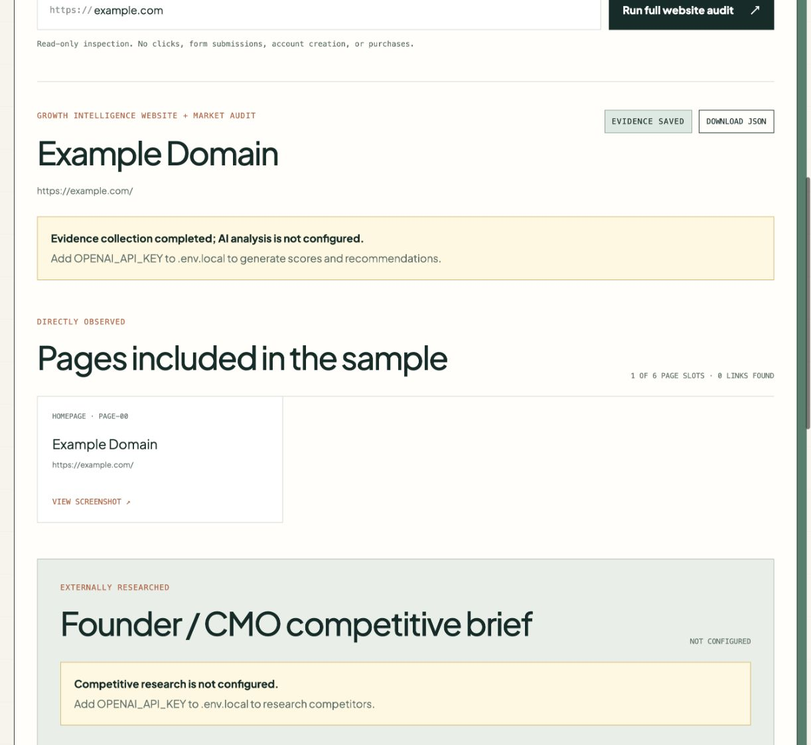
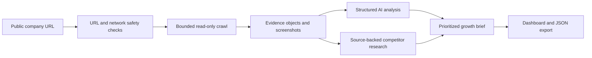

# AI Growth Intelligence Auditor

**Turn a public website into an evidence-backed brief for positioning, conversion, SEO, and competitive decisions.**

The auditor gives a growth team one place to inspect what a company says, how visitors are guided toward conversion, and how that story compares with the market. It collects the evidence first, then uses structured AI analysis to turn that evidence into prioritized decisions.


_Actual application screen. No client, employer, or private account data is shown._

## What it does

Give the application a public company URL and it will:

1. Validate that the destination is a safe, public web address.
2. Inspect the homepage and select a bounded sample of relevant product, pricing, solution, customer, resource, and company pages.
3. Capture page titles, headings, hero copy, CTAs, forms, proof statements, SEO signals, links, and screenshots.
4. Assign stable evidence IDs to the observations.
5. Optionally use the OpenAI API to score positioning, website/CRO, and SEO against that evidence.
6. Optionally research competitors and preserve the public sources behind the comparison.
7. Return a readable dashboard and downloadable structured JSON.

The central design rule is simple: **observed evidence, hypotheses, and recommendations are different things.** Recommendations must cite the evidence that supports them.

## What works today

| Capability | Status | Output |
|---|---|---|
| Safe public-URL validation | Implemented | Blocks private-network and unsafe targets |
| Bounded website crawl | Implemented | Up to 8 representative pages |
| Marketing evidence extraction | Implemented | Messaging, CTAs, forms, proof, SEO, and link signals |
| Screenshot capture | Implemented | Full-page evidence saved with each audit |
| Structured AI analysis | Implemented; API key required | Scores, hypotheses, and prioritized recommendations |
| Competitive web research | Implemented; API key required | Competitor profiles, positioning matrix, sources, and battlecard starters |
| JSON export | Implemented | Complete audit result for further analysis |
| Lifecycle email analysis | Product concept | Demonstrated separately with fictional data; not connected to this public app |

## What the output looks like

The base application can collect evidence without an AI key. The screen below is a real run against `example.com`; it shows the page sample and observed evidence while clearly identifying that AI analysis is not configured.



With `OPENAI_API_KEY` configured, the same result view also includes:

- A concise executive summary
- Positioning, website/CRO, and SEO scores
- Evidence-linked hypotheses
- Prioritized recommendations ranked by impact and effort
- Competitor profiles and a positioning matrix
- Strategic whitespace and 90-day actions
- Public source links for externally researched claims

## How the workflow is protected



- Browser traffic is limited to `GET`, `HEAD`, and `OPTIONS` requests.
- WebSocket connections and private-network destinations are blocked.
- The crawler does not submit forms, create accounts, make purchases, or bypass CAPTCHAs.
- AI outputs are checked against known evidence and source IDs.
- OpenAI responses are requested with storage disabled.

## Install and run

### Requirements

- Node.js 22 or newer
- pnpm 11 or newer
- Chromium installed through Playwright
- Optional: an OpenAI API key for scoring, recommendations, and competitor research

### 1. Clone the project

```bash
git clone https://github.com/Jlopez-nava/ai-growth-intelligence-auditor.git
cd ai-growth-intelligence-auditor
```

### 2. Install the application and browser

```bash
pnpm install
pnpm playwright:install
```

### 3. Configure the optional AI analysis

```bash
cp .env.example .env.local
```

Open `.env.local` and add your own server-side key:

```dotenv
OPENAI_API_KEY=your_key_here
OPENAI_MODEL=gpt-5.6-terra
```

Never commit `.env.local`. The OpenAI client reads the key only on the server. See the [official Responses API documentation](https://developers.openai.com/api/reference/typescript/resources/responses/methods/create) for the API used by this project.

You can leave the key blank if you only want to test the crawler and evidence extraction.

### 4. Start the application

```bash
pnpm dev
```

Open [http://localhost:3000](http://localhost:3000), enter a public website, and select **Run full website audit**.

Each run is saved under `artifacts/<audit-id>/` with a `result.json` file and the captured page screenshots. The entire `artifacts` directory is ignored by Git.

## Build and verify

```bash
pnpm typecheck
pnpm lint
pnpm test
pnpm build
```

For a production preview:

```bash
pnpm start
```

Run `pnpm build` before `pnpm start`.

## Project map

```text
src/app/                        Application interface and audit API
src/lib/audit/                  URL safety, crawl selection, and evidence extraction
src/lib/openai/                 Structured analysis and competitor research
tests/                          URL, crawl, extraction, and audit tests
browser-use-service/            Optional experimental browser companion
assets/                         Real application screenshots and design references
```

The optional Python browser companion is deliberately separate from the request path. The main application uses deterministic Playwright extraction because it is easier to constrain, test, and audit.

## Public-project boundaries

This repository contains the working website-audit and competitor-research engine. It intentionally excludes authentication handlers, persistence schemas, deployment configuration, client data, private audit evidence, and mailbox integrations. The lifecycle experience is presented as a separate fictional product concept rather than as an implemented public integration.

## Stack

`Next.js` · `TypeScript` · `React` · `Playwright` · `OpenAI Responses API` · `Zod`
