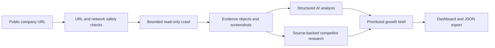

# SubGrowth Digital — Growth Intelligence Auditor

**Turn a public website into an evidence-backed brief for positioning, conversion, SEO, and competitive decisions.**

The auditor gives a growth team one place to inspect what a company says, how visitors are guided toward conversion, and how that story compares with the market. It collects the evidence first, then uses structured AI analysis to turn that evidence into prioritized decisions.


_Actual local interface captured September 27, 2026. Saved audit history is hidden for privacy. The lifecycle link shown belongs to the full local product; the public source distribution remains website-audit only._

## What's changed in the full product

The full local application has evolved beyond website audits:

- Read-only Gmail research ingestion with company association, chronological sequences, and duplicate prevention.
- Historical screenshot uploads: scan and grade up to eight emails at a time, with grouped screenshots for long messages and individual retry states.
- Evidence-backed lifecycle scores, free-to-paid readiness, and CEO/CMO/lifecycle-director briefs focused on growth, conversion, upsell, and feature adoption.
- Safe email previews and concise, branded executive PDF exports.
- A redesigned workspace with Overview, Emails, and Detailed analysis tabs, simpler setup, explicit upload destinations, and mobile layouts.

See the [consolidated product changelog](CHANGELOG.md), [workflow and scoring guide](docs/product-guide.md), and [new screenshot gallery](docs/screenshots/README.md).

**Distribution boundary:** these lifecycle capabilities work in the full local application. This documentation update does not publish their implementation, authentication handlers, mailbox integration, or persistence schemas. Cloning this public repository still provides the website and competitor-audit engine.


## What it does

Give the application a public company URL and it will:

1. Validate that the destination is a safe, public web address.
2. Inspect the homepage and select a bounded sample of relevant product, pricing, solution, customer, resource, and company pages.
3. Capture page titles, headings, hero copy, CTAs, forms, proof statements, SEO signals, links, and screenshots.
4. Assign stable evidence IDs to the observations.
5. Optionally use the OpenAI API to score positioning, website/CRO, and SEO against that evidence.
6. Optionally research competitors and preserve the public sources behind the comparison.
7. Return a readable dashboard and downloadable structured JSON.

The central design rule is simple: **observed evidence, hypotheses, and recommendations are different things.** Recommendations must cite the evidence that supports them.

## What works today

| Capability | Status | Output |
|---|---|---|
| Safe public-URL validation | Implemented | Blocks private-network and unsafe targets |
| Bounded website crawl | Implemented | Up to 8 representative pages |
| Marketing evidence extraction | Implemented | Messaging, CTAs, forms, proof, SEO, and link signals |
| Screenshot capture | Implemented | Full-page evidence saved with each audit |
| Structured AI analysis | Implemented; API key required | Scores, hypotheses, and prioritized recommendations |
| Competitive web research | Implemented; API key required | Competitor profiles, positioning matrix, sources, and battlecard starters |
| JSON export | Implemented | Complete audit result for further analysis |
| Lifecycle email analysis and screenshot grading | Implemented in the full local app; not distributed here | Documented scores, sequence analysis, executive briefs, and PDF export |

## What the output looks like

The base application can collect evidence without an AI key. An [earlier evidence-only example](assets/ai-growth-audit-results-live.jpg) shows a real run against `example.com`, with the page sample and observed evidence while AI analysis is not configured. For current UI captures, see the [updated gallery](docs/screenshots/README.md).

With `OPENAI_API_KEY` configured, the same result view also includes:

- A concise executive summary
- Positioning, website/CRO, and SEO scores
- Evidence-linked hypotheses
- Prioritized recommendations ranked by impact and effort
- Competitor profiles and a positioning matrix
- Strategic whitespace and 90-day actions
- Public source links for externally researched claims

## How the workflow is protected


```mermaid
flowchart LR
    A[Public company URL] --> B[URL and network safety checks]
    B --> C[Bounded read-only crawl]
    C --> D[Evidence objects and screenshots]
    D --> E[Structured AI analysis]
    D --> F[Source-backed competitor research]
    E --> G[Prioritized growth brief]
    F --> G
    G --> H[Dashboard and JSON export]
```

- Browser traffic is limited to `GET`, `HEAD`, and `OPTIONS` requests.
- WebSocket connections and private-network destinations are blocked.
- The crawler does not submit forms, create accounts, make purchases, or bypass CAPTCHAs.
- AI outputs are checked against known evidence and source IDs.
- OpenAI responses are requested with storage disabled.

## Install and run

### Requirements

- Node.js 22 or newer
- pnpm 11 or newer
- Chromium installed through Playwright
- Optional: an OpenAI API key for scoring, recommendations, and competitor research

### 1. Clone the project

```bash
git clone https://github.com/Jlopez-nava/ai-growth-intelligence-auditor.git
cd ai-growth-intelligence-auditor
```

### 2. Install the application and browser

```bash
pnpm install
pnpm playwright:install
```

### 3. Configure the optional AI analysis

```bash
cp .env.example .env.local
```

Open `.env.local` and add your own server-side key:

```dotenv
OPENAI_API_KEY=your_key_here
OPENAI_MODEL=gpt-5.6-terra
```

Never commit `.env.local`. The OpenAI client reads the key only on the server. See the [official Responses API documentation](https://developers.openai.com/api/reference/typescript/resources/responses/methods/create) for the API used by this project.

You can leave the key blank if you only want to test the crawler and evidence extraction.

### 4. Start the application

```bash
pnpm dev
```

Open [http://localhost:3000](http://localhost:3000), enter a public website, and select **Run full website audit**.

Each run is saved under `artifacts/<audit-id>/` with a `result.json` file and the captured page screenshots. The entire `artifacts` directory is ignored by Git.

## Build and verify

```bash
pnpm typecheck
pnpm lint
pnpm test
pnpm build
```

For a production preview:

```bash
pnpm start
```

Run `pnpm build` before `pnpm start`.

## Project map

```text
src/app/                        Application interface and audit API
src/lib/audit/                  URL safety, crawl selection, and evidence extraction
src/lib/openai/                 Structured analysis and competitor research
tests/                          URL, crawl, extraction, and audit tests
browser-use-service/            Optional experimental browser companion
assets/                         Historical screenshots and design references
docs/                           Current product guide and privacy-safe screenshots
CHANGELOG.md                    Consolidated full-product change record
```

The optional Python browser companion is deliberately separate from the request path. The main application uses deterministic Playwright extraction because it is easier to constrain, test, and audit.

## Public-project boundaries

This repository contains the working website-audit and competitor-research engine. It intentionally excludes authentication handlers, persistence schemas, deployment configuration, client data, private audit evidence, and mailbox integrations. The lifecycle experience is now implemented in the full local product and documented with privacy-safe interface captures; its integration is still excluded from this public source distribution. Historical SVG concept assets are retained for reference, not as current product screenshots.

## Stack

`Next.js` · `TypeScript` · `React` · `Playwright` · `OpenAI Responses API` · `Zod`
