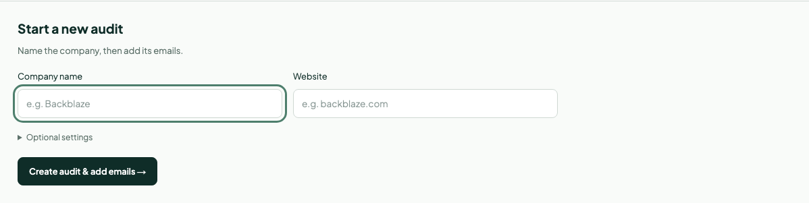
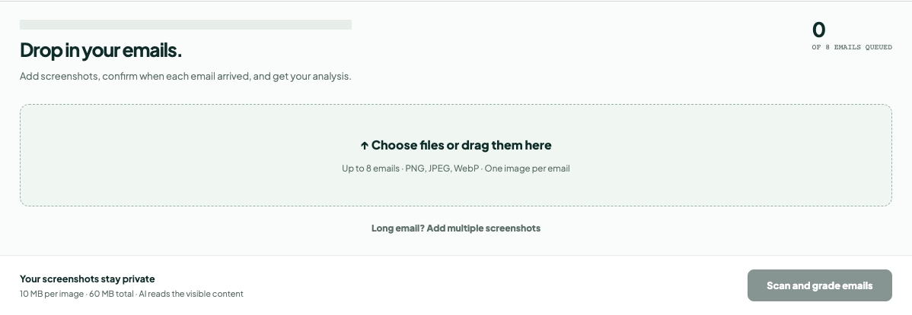
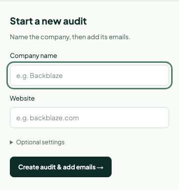

# Current interface screenshots

Captured from the running local application on 2026-09-27. These are real interface captures, not mockups. Lifecycle functionality shown here belongs to the full local application and is not included in the reduced public source distribution.

## Website audit entry

Saved audit history is hidden for privacy. The seven dimensions at the bottom describe future scope, not seven completed scoring integrations.

## Create a lifecycle audit

Only company name and website are required initially. Research settings are optional.

## Upload historical emails

Multiple emails can be added together; long emails can use grouped screenshots. The company destination is masked in this image. No private messages or analysis results are displayed.

## Mobile setup

## Refresh procedure

In the full application workspace, start the local server and run `node scripts/capture-doc-screenshots.cjs`. The script reads admin credentials from the ignored `.env.local`; optionally select an existing session through `DOCS_SESSION_ID`. It never submits forms, creates records, syncs Gmail, or calls AI analysis. It captures the blank setup forms and upload entry only, hiding saved audit history and masking the destination label.

Review every generated image before publishing. Do not publish live email previews, recipient addresses, research aliases, private reports, signed storage URLs, or credentials. The capture helper requires the full local application and is not included in the reduced public distribution.
